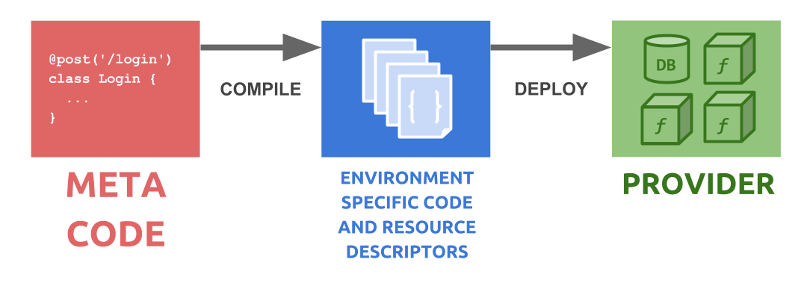

## Abstract

Nowadays we have many abilities to **implement our web services within scalable cloud providers**. They provide similar interfaces to describe our business logic in an **abstract way** without scaling efforts. Including the more and more popular serverless technologies, these technologies allow the **fast prototyping**, even though that the service set of any such provider has a steep learning curve for using it professionally and deeply exploited. So we can declare the migration between two provider as the next technical effort.

Cloud technologies once already led us to abstract our implementation of the business logic in first order (**logic abstraction**), then why should we bind us to a particular provider and adhere to that? This is the second abstraction order: the **provider abstraction**.

## Motivation

For example [serverless](https://www.npmjs.com/package/serverless) is a convenient, but also a very limited framework. Your serverless code is not able to migrate to an other cloud provider or even a dockerized express app. Your deployment flow is also very limited.

[Functionly](https://www.npmjs.com/package/functionly) is a more innovative concept and framework. Its principles are:

1) **Logic abstraction**: Hide the process and protocol handling. Describe your services in pure functions, and just work with the efficient business data.
2) **Provider abstraction**: Hide the infrastructural elements. Provide your side effects via injection mechanism.
3) **Unlimited control**: Ensure the access to the native and low-level implementations. Even one runtime/deploy lifecycle controlling or even native resource settings. But all of them must be defined strictly separated from your logic implementations.

These principles guarantee the independency and portability of your application.

### Logic abstraction

Lets suppose we are developing a microservice. We all have know that a microservice defines a logic unit of the entire service and it has a sctrictly defined scope in the system. At the most of cases microservices are able to replace them gracefully without any downtime for the whole system.

Despite the microservice's logic is defined definitely, you have to implement a lot of things above this logic for each service:

- HTTP request handling
- message handling
- endpoint discovery: locate other services
- connection handling for databases
- logging and tracing
- graceful startup handling
- graceful termination handling
- etc


Actually the bigest part of the service is not already your logic. Including them microservices cannot be *micro* anymore.

Serverless technologies allow you to forget some stuff from this list, and from now you can focus only to your service logic. Almost...

### Provider abstraction

Logic abstraction is cool, but you still must ensure the cloud environment with a lot of settings:

- continous integration
- forming environment stages (`dev`, `stage`, `prod`, etc.)
- proper resource naming (db table names, queue names, etc.)
- auth and api gateway configurations
- role configurations
- security configurations
- cache configurations
- logging scopes
- scaling parameters
- etc

This could be an other special profession, you must have these skills for every provider you ever met and work.

Our aim is to give a **solution for the three principles of functionly**.

## [Functionly](https://www.npmjs.com/package/functionly)

The purpose is describing the **pure business logic as a Service** without handling the protocol or any other technical overhead. Using this you can define any infrastrucural setup with decorators.

```js
@post('/login')
class Login extends Service {
  static async handle(@param username, @param password, @inject(UserTable) users) {
    const user = await users.find({ username, password: md5(password) })
    if (!user) throw new Exception('Invalid username or password')
    return user
  }
}
```

then deploy with the CLI

```
functionly deploy aws
```

or run locally

```
functionly local
```

## Concept

What happens exactly? Look at the snippet above. We made a *Login service*. The first and most important aspect, that with [functionly](https://www.npmjs.com/package/functionly) we do not implement working code, we are just doing **metaprogramming**. Every service is a meta description, from that [functionly](https://www.npmjs.com/package/functionly) is able to build a working code in several environment. For example in an [express](https://www.npmjs.com/package/express) application that will look like to similar this:

```js
express().post('/login', async ({ query: { username, password } }, res) => {
  const user = await users.find({ username, password: md5(password) })
  if (!user) throw new Exception('Invalid username or password')
  res.json(user)
})
```

In [AWS](https://aws.amazon.com/) environment the `handle` method will be a [lambda function](http://docs.aws.amazon.com/lambda/latest/dg/lambda-introduction-function.html), with `POST /login` routing.

This way, `Login class` never will be an instance. The `static handle` method is the only implementation in our code, which is going to be used in the implementation in [functionly](https://www.npmjs.com/package/functionly).

The `class` is only necessary for describing meta informations with decorators. **We decorate our service with infrastructural informations.** This way a service will never be just a function. This is rather one a `json` object, with a pure logic implementation as a function, something like this:

```js
{
  type: 'DYNAMO_TABLE',
  name: 'UserTable',
  tableDefinition: {
    columns: [ 'username', 'password' ]
  }
}

{
  type: 'REST_SERVICE',
  name: 'LoginService',
  dependencies: ['UserTable'],
  restDefinition: {
    method: 'POST',
    route: '/login',
    implementation: dependencies => params => { ... }
  }
}
```

This description form is more able to be a portable service.

[Functionly](https://www.npmjs.com/package/functionly) resolves the dependencies, ensures the proper roles for these dependencies, ensures the environment and resources, and wraps the implementations with the given environment. That's result is an environment specific code with resource descriptors already. This will deployey to the choosen provider.



**The primary advantage of [functionly](https://www.npmjs.com/package/functionly) is the provider-independent code.** You can deploy your meta-code to many supported provider. And if you miss one of them, you are unrestricted for create the connector as a plugin.


## Easy to test

The injection mechanism of [functionly](https://www.npmjs.com/package/functionly) makes easy to mock dependencies for services, because service implementations are pure side-effect-less functions.

The components of your architecture form a dependency network. You can always slice a sub-network and you can test it separately even a single servie or even a service-group.

