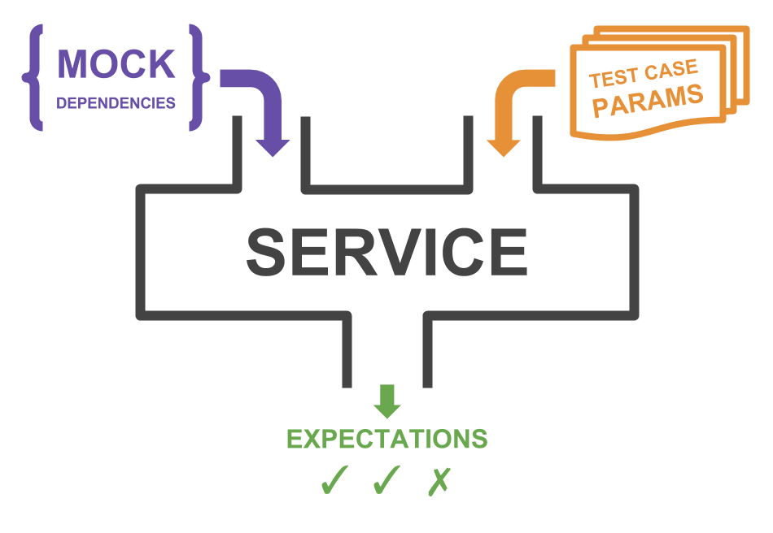

#  functionly

## Abstract

Nowadays, we have many options for **implementing web services with scalable cloud providers**. They provide similar interfaces to describe our business logic in an **abstract way** without scaling effort. Including the increasingly popular serverless architecture, these technologies allow for **fast prototyping**, even though the service components of any such provider have a steep learning curve for using it professionally. So we can declare the migration between two providers as the next technical effort.

Cloud technologies have already led us to abstract our implementation of business logic in the first order (**logic abstraction**), therefore why should we be bound to a particular provider? This is the second abstraction order; the **provider abstraction**.

## Motivation

For example [serverless](https://www.npmjs.com/package/serverless) is a convenient, but limited framework. Your serverless code is not able to migrate to other cloud providers or even a dockerised express app. Your deployment flow is also very limited.

[Functionly](https://www.npmjs.com/package/functionly) is a more innovative concept and framework. Its principles are:

1) **Logic abstraction**: Hide the process and protocol handling. Describe your services in **pure functions**, and simply work with the efficient business data.
2) **Provider abstraction**: Hide the infrastructure elements. Provide your side effects via an **injection mechanism**.
3) **Unlimited control**: Ensure the access to the native and low-level implementations. Even one runtime/deploy lifecycle controlling or even native resource settings. But all of them must be defined strictly separated from your logic implementations.

These principles guarantee your applications are independent and portable.

### Logic abstraction

Let's suppose we are developing a microservice. We all know a microservice defines a logic unit of the entire service and has a strictly defined scope within the system. In most cases, microservices are able to replace them gracefully without any downtime for the whole system.

Even though microservices' logic is defined definitely, you have to implement a lot of things on top of this logic for each service:

- HTTP request handling
- message handling
- endpoint discovery: locate other services
- connection handling for databases
- logging and tracing
- graceful startup handling
- graceful termination handling
- etc


Actually, the largest part of the service is not your logic. Including them as microservices means they cannot be *micro* anymore.

Serverless technologies allow you to forget items from this list, and ensures you can focus only on your service logic. Almost...

### Provider abstraction

Logic abstraction is great, but you still need to ensure the cloud environment with the following settings:

- continous integration
- forming environment stages (`dev`, `stage`, `prod`, etc.)
- proper resource naming (db table names, queue names, etc.)
- auth and api gateway configurations
- role configurations
- security configurations
- cache configurations
- logging scopes
- scaling parameters
- etc

Understanding each cloud environment could be a specialisation in itself meaning you need to bring in the skills for every provider you ever come across.

Our aim is to provide a **solution via the three key principles of functionly**.

## [Functionly](https://www.npmjs.com/package/functionly)

The purpose is describing the **pure business logic as a Service** without handling the protocol or any other technical overhead. Using this you can define any infrastrucural setup with decorators.

```js
@post('/login')
class Login extends Service {
  static async handle(@param username, @param password, @inject(UserTable) users) {
    const user = await users.find({ username, password: md5(password) })
    if (!user) throw new Error('Invalid username or password')
    return user
  }
}
```

then deploy with the CLI

```
functionly deploy aws
```

or run locally

```
functionly local
```

[Functionly](https://www.npmjs.com/package/functionly) brings the functional approach to nodejs hosted conventional microservices - providing you an easy way to go serverless once you are ready to give up meddling with nodejs and docker.

## Concept

What happens exactly? Look at the code snippet above. We created a Login service. The most important aspect with [functionly](https://www.npmjs.com/package/functionly) is we do not implement working code, we are simply **meta-programming**. Every service is a meta description and [functionly](https://www.npmjs.com/package/functionly) is able to build working code in several environments. For example in an [express](https://www.npmjs.com/package/express) application, it will look like to similar this:

```js
express().post('/login', async ({ body: { username, password } }, res) => {
  const user = await users.find({ username, password: md5(password) })
  if (!user) throw new Error('Invalid username or password')
  res.json(user)
})
```

In [AWS](https://aws.amazon.com/) environments the `handle` method will be a [lambda function](http://docs.aws.amazon.com/lambda/latest/dg/lambda-introduction-function.html), with `POST /login` routing.

This way, `Login class` never will be an instance. The `static handle` method is the only implementation (in our code) which is going to be used in the implementation of [functionly](https://www.npmjs.com/package/functionly).

The `class` is only necessary for describing meta informations with decorators. **We decorate our services with metadata**. This way a service will never be just a function. This is rather one `Json` object, with a pure logic implementation as a function, like the following:

```js
{
  type: 'DYNAMO_TABLE',
  name: 'UserTable',
  tableDefinition: {
    columns: [ 'username', 'password' ]
  }
}

{
  type: 'REST_SERVICE',
  name: 'LoginService',
  dependencies: [ 'UserTable' ],
  restDefinition: {
    method: 'POST',
    route: '/login',
    implementation: dependencies => params => { ... }
  }
}
```

This description form is more able to be a portable service.

[Functionly](https://www.npmjs.com/package/functionly) resolves the dependencies, ensures the proper roles for these dependencies, ensures the environment and resources, and wraps the implementations with the given environment. The result is environment specific code with resource descriptors already provided. This will deployed to the chosen provider.


**One of the primary advantages of [functionly](https://www.npmjs.com/package/functionly) is the provider-independent code**. You can deploy your meta-code to many providers. If you miss one of them, you are unrestricted in creating the connector as a plugin.


## Easy to test

The injection mechanism of [functionly](https://www.npmjs.com/package/functionly) makes (easy to mock) dependencies for services, because service implementations are pure side-effect-less functions.

The components of your architecture form a dependency network. You can always slice a sub-network and test it separately, as a single service or even as a service-group.


